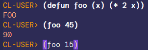
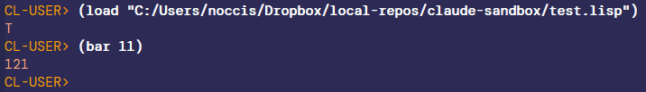
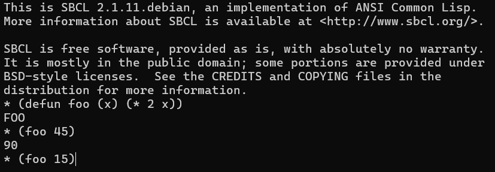
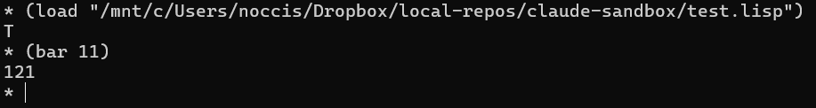
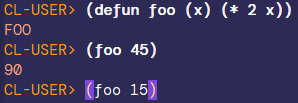
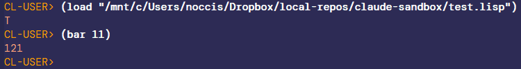

# claude-lisp-repl

Recipes (prompts and helper functions) for letting **Claude Code drive a live Common Lisp REPL image** — so it can define functions, load files, and run tests inside the *same* running SBCL you're working in, instead of spawning a throwaway process on every step.

The image is long-lived and shared: you and Claude both interact with it, independently, and **every interaction Claude makes lands as visible input in the SLIME REPL** — it appears in your history and scrollback exactly as if you had typed it. Nothing happens down a side channel. This keeps Lisp's interactive, image-based workflow intact while Claude works alongside you.

The **main recipe** drives an **Emacs/SLIME** REPL and works against **either a Windows Emacs or a native Linux/WSL Emacs**. Claude detects which Emacs is running, **states which one it is driving**, and **asks you** if both are available. Two older transports are kept as annexes.

| Recipe                                                                         | REPL lives in               | You interact via                | Use when                                                                       |
|--------------------------------------------------------------------------------|-----------------------------|---------------------------------|--------------------------------------------------------------------------------|
| **[Emacs/SLIME (main)](#driving-an-emacsslime-repl-windows-or-linux)**          | Emacs-launched SLIME (SBCL) | Emacs (SLIME), Windows or Linux | The normal case: Emacs manages the image, Claude drives it through the REPL.    |
| [Annex A — tmux, no Emacs](#annex-a--tmux-repl-no-emacs)                        | tmux (SBCL)                 | tmux                            | You want the simplest possible shared REPL, no Emacs.                          |
| [Annex B — tmux image + separate Emacs](#annex-b--tmux-image-behind-a-separate-emacs) | WSL tmux (SBCL + swank) | Windows Emacs (SLIME)           | You run SBCL in WSL tmux but edit in a separate (Windows) Emacs and want SLIME. |

A recurring convention across all recipes: **"stage"** means *send instructions to the REPL without executing them* (no `Enter`) — so you can review or tweak before evaluating.

The main recipe and Annex B share one set of elisp helpers, [`slime-bridge.el`](slime-bridge.el), covering staging, submitting, waiting for the prompt, reading output back, reporting which Emacs answered, and signalling when the REPL falls idle — see [Helper functions](#helper-functions).

Any comment? Open an [issue](https://github.com/occisn/claude-lisp-repl/issues), or start a discussion [here](https://github.com/occisn/claude-lisp-repl/discussions) or [at profile level](https://github.com/occisn/occisn/discussions).

## Prerequisites

- **SBCL** — the Lisp implementation driven in every recipe.
- **Emacs with SLIME** — the main recipe and Annex B. Either a **Windows** Emacs or a **native Linux/WSL** Emacs works; the main recipe supports both.
- **Quicklisp** — needed to `(ql:quickload :swank)` in Annex B.
- **tmux** — Annexes A and B.

The main recipe and Annex B also use [`slime-bridge.el`](slime-bridge.el) from this repository; see [Helper functions](#helper-functions).

## Contents

- [Prerequisites](#prerequisites)
- [Driving an Emacs/SLIME REPL (Windows or Linux)](#driving-an-emacsslime-repl-windows-or-linux)
- [Targets: Windows or Linux Emacs](#targets-windows-or-linux-emacs)
- [Helper functions](#helper-functions)
- [Compilation policy and catching errors](#compilation-policy-and-catching-errors)
- [Annex A — tmux REPL, no Emacs](#annex-a--tmux-repl-no-emacs)
- [Annex B — tmux image behind a separate Emacs](#annex-b--tmux-image-behind-a-separate-emacs)

## Driving an Emacs/SLIME REPL (Windows or Linux)

Emacs manages the Lisp image itself (SLIME launches SBCL with swank); Claude
drives that REPL through the visible SLIME buffer. Works against a **Windows** or
a **native Linux/WSL** Emacs — see [Targets](#targets-windows-or-linux-emacs).

**Step 1** — In the Emacs you want to use: `M-x server-start`. (If SLIME is not
already running there, `M-x slime` starts SBCL + swank and opens a REPL.)

**Step 2** — Claude prompt:

*(The helper functions are in a single file, [`slime-bridge.el`](slime-bridge.el) — let Claude load it, or paste its contents at the end of this prompt.)*

````
There may be a Windows Emacs, a native Linux/WSL Emacs, or both. Before anything else, detect which is available and tell me which one you will drive.

Probe both (a target answers only if that Emacs has `M-x server-start` running):

```sh
# Native Linux/WSL Emacs:
emacsclient --eval '(emacs-version)' 2>/dev/null
# Windows Emacs (adjust the path to your install):
/mnt/c/portable-programs/emacs-30.2/bin/emacsclient.exe --eval '(emacs-version)' 2>/dev/null
```

- If exactly one answers, use it.
- If BOTH answer, ASK me which one to use before proceeding.
- If NEITHER answers, tell me; I will start `M-x server-start` (and `M-x slime` if needed) in the Emacs I want.

Once you have picked a target, use its `emacsclient` for every later call, load the helpers (below), call `(my/slime-host-info)`, and STATE PLAINLY which Emacs you are driving and which path rules apply — e.g. "Driving the native Linux Emacs (system-type gnu/linux) via emacsclient — plain paths, no translation." or "Driving the Windows Emacs (system-type windows-nt) via emacsclient.exe — Windows paths for Emacs/image, /mnt/c/... for the shell." `(my/slime-host-info)`'s `:emacs-system-type` is the ground truth; do not guess from the binary name alone.

If SLIME is not connected yet, tell me and I will start it (`M-x slime`, default swank port 4005).

The user may be interacting with the Lisp image through the Emacs REPL on its own, independently from you.

If you need to send several instructions to the REPL, send them one at a time, waiting for the prompt to return between them.

Fire and report: when I ask you to stage something, stage it and just tell me "staged"; when I ask you to execute something, send it and tell me "sent". Do not poll, do not wait for the evaluation to finish, and do not fetch the output to analyse it — I am watching the REPL and can already see the result. Collect and interpret output only when I explicitly ask ("what did that return?"). After staging, leave the prompt alone: checking whether the staged form is still pending just races my RET. One `(my/slime-busy-p)` call before sending a *new* form is fine — that is a precondition check, not result analysis, and it stops you firing into a busy REPL or an open SLDB debugger.

In our future interactions, "stage" instructions would mean send instructions to the REPL without executing them (no 'Enter').

I want all your interactions (stage, execute, load, etc.) with the image to go through the visible Emacs REPL — never a silent `slime-eval`, which runs the form but shows me nothing.

Path rules depend on the target you picked:

- NATIVE LINUX/WSL Emacs: Emacs, the image and your shell all use the same plain paths (`/home/...`, `/mnt/c/...`, `/tmp/...`). No translation — `load-file`, `load`, `asdf` and the `...-to-file` / `send-then-touch` helpers all take identical paths everywhere.
- WINDOWS Emacs: Emacs and the image are Windows processes, your shell is WSL, so the same file has two spellings. Paths sent to Emacs (`load-file`) or into the image (`load`, `asdf`) must be Windows form (`C:/...`); paths for your own shell tools must be WSL form (`/mnt/c/...`). For the file-exchange helpers, the file is written by the Windows Emacs, so give the helper a Windows path and read the SAME file from the shell via its `/mnt/c/...` spelling — a bare `/tmp/x` will not round-trip.

I do not want you to force the REPL buffer onto whatever buffer the user is working on in Emacs. First check if the buffer is open somewhere in a frame or window.

Helper functions for staging, sending, waiting for the prompt and reading output back are in [`slime-bridge.el`](slime-bridge.el) of this repository. Load them in the running Emacs, using a path in that Emacs's OWN namespace (Linux path for a Linux Emacs, `C:/...` for a Windows Emacs, even when you call it from WSL):

```sh
emacsclient --eval '(load-file "/path/to/claude-lisp-repl/slime-bridge.el")'
```

Then:

| Need | Call |
|------|------|
| which Emacs am I driving (target + path rules) | `(my/slime-host-info)` |
| stage without evaluating | `(my/slime-stage "FORM")` |
| submit | `(my/slime-send "FORM")` |
| submit and read the result | `(my/slime-send-wait "FORM" TIMEOUT)` |
| submit, catching errors in the REPL instead of SLDB | `(my/slime-send-capturing "FORM")` |
| bound a hang deterministically (safer than interrupt) | `(my/slime-send-timed "FORM" SECONDS)` |
| slow work (system load, test run) | `(my/slime-mark)`, `(my/slime-send ...)`, poll `(my/slime-busy-p)` from the shell, then `(my/slime-output-since-mark)` |
| be *told* when idle instead of polling (sentinel file for the shell to wait on) | `(my/slime-send-then-touch "/tmp/done" "FORM")`, then `while [ ! -e /tmp/done ]; do sleep 0.2; done` |
| submit + wait, output to a file (dodges escaping on noisy builds) | `(my/slime-send-wait-to-file "/tmp/out.txt" "FORM" TIMEOUT)` |
| output without escaping | `(my/slime-output-since-mark-to-file "/tmp/out.txt")`, `(my/slime-repl-tail-to-file ...)` |
| stop a runaway form | `(my/slime-interrupt)` |
| read the backtrace after an interrupt | `(my/slime-sldb-backtrace)` / `(my/slime-sldb-backtrace-to-file "/tmp/bt.txt")` |
| leave the debugger | `(my/slime-sldb-abort)` |
| where am I | `(my/slime-repl-status)` |

(On a Windows Emacs, the `/tmp/...` file paths above must follow the path rules: a Windows path for the helper, its `/mnt/c/...` spelling for the shell.)

Do not use `my/slime-send-wait` for slow work: it blocks Emacs in `sleep-for`, which queues the user's keystrokes and makes Emacs feel frozen until the form finishes. Poll from the shell instead, so the sleeping happens outside Emacs.

Expect slow to look like stuck. Touching a file near the root of a `:serial t` ASDF system makes every downstream file recompile, so a `test-system` can sit silent for many minutes and be perfectly healthy. Judge by whether `(my/slime-repl-status)`'s `:tail` is *moving*, not by elapsed time — and if it really is wedged, `(my/slime-interrupt)` ends it without touching the user's window.

In day-to-day use you will reach for `my/slime-stage` and `my/slime-send` far more than the reading helpers: the user is watching the REPL, so the default is to fire and report rather than to read results back. The reading helpers earn their place when the user *asks* for output, and when a long build needs watching without freezing Emacs.

If you find better variants, tell me so I can improve this prompt.
````

**Step 3** — When Claude says it is ready, interact normally. A few example prompts:

**Example 1:**

```
Create a `foo` function which doubles its argument. Apply it to 45. Stage (foo 15).
```



*On the above picture, all interactions with REPL have been performed by Claude directly, with no manual input.*

**Example 2:**

```
I have executed a command in the Lisp REPL within Emacs. Do you see it? What was the result?
```

**Example 3:**

```
In `test.lisp`, create a `bar` function which squares its argument. Load it in the image and apply it to 11.
```



*On the above picture, all interactions with REPL have been performed by Claude directly, with no manual input.*

**Other examples, involving systems:**

```
Force load cl-abc system and launch main function
```

```
I have modified code; force reload and execute main function
```

```
Launch system tests
```

**Example involving the debugger and compilation policy:**

```
Force the compiler to debug 3 / speed 0, reload cl-abc, then run (main) but catch any error in the REPL instead of dropping me into SLDB — I want to see the condition and a backtrace.
```

This has Claude send `(sb-ext:restrict-compiler-policy 'debug 3)` (and `(sb-ext:restrict-compiler-policy 'speed 0 0)` to actually cap speed — a bare `'speed 0` is a no-op), `(asdf:load-system "cl-abc" :force t)`, then `(my/slime-send-capturing "(main)")` — see [Compilation policy and catching errors](#compilation-policy-and-catching-errors).

**Example where a test hangs:**

```
The test seems stuck — interrupt it and show me the backtrace so we can see where it is spinning, then get the REPL back.
```

Claude sends `(my/slime-interrupt)`, reads `(my/slime-sldb-backtrace)` (the frames name the looping function and, at `debug 3`, its arguments), then `(my/slime-sldb-abort)` to return to the prompt.

**Note:** you can obviously still use Emacs commands to modify and compile sections of code yourself, for instance `C-c C-c`.

---

## Targets: Windows or Linux Emacs

Claude runs in a WSL shell, but the Emacs it drives may be **either**:

- a **native Linux/WSL Emacs**, reached with the plain `emacsclient` on `PATH` (e.g. `/usr/bin/emacsclient`); or
- a **Windows Emacs**, reached with `emacsclient.exe` (e.g. `/mnt/c/portable-programs/emacs-30.2/bin/emacsclient.exe`).

The one thing that differs between them is **paths**, because in the Windows case Emacs and the image are Windows processes while Claude's shell is WSL:

| | Native Linux/WSL Emacs | Windows Emacs |
|---|---|---|
| `emacsclient` binary | `emacsclient` (PATH) | `.../emacsclient.exe` |
| `system-type` (ground truth) | `gnu/linux` | `windows-nt` |
| Paths sent to Emacs (`load-file`) and into the image (`load`, `asdf`) | plain Linux (`/home/…`, `/mnt/c/…`) | **Windows** (`C:/…`) |
| Paths for Claude's own shell tools | plain Linux (`/home/…`, `/tmp/…`) | **WSL** (`/mnt/c/…`) |
| File-exchange helpers (`…-to-file`, `send-then-touch`) | same path everywhere | Windows path for the helper, **its `/mnt/c/…` spelling** for the shell |
| Path translation needed | **none** | dual-spelling, always |

The native target needs **no translation at all** — Emacs, the image, and the shell all speak the same Linux paths. The Windows target needs the dual-spelling dance on every path.

**Detection, statement, and choice (Claude does this at launch):**

1. Probe both — a target "answers" only if its Emacs has `M-x server-start` running:

   ```sh
   # Native Linux/WSL Emacs:
   emacsclient --eval '(emacs-version)' 2>/dev/null
   # Windows Emacs (adjust the path to your install):
   /mnt/c/portable-programs/emacs-30.2/bin/emacsclient.exe --eval '(emacs-version)' 2>/dev/null
   ```

2. **Exactly one answers** → use it and **state which one** (see below).
3. **Both answer** → **ask the user which to use** before doing anything else.
4. **Neither answers** → say so; the user starts `M-x server-start` (and SLIME) in the Emacs they want.
5. Once chosen, load the bridge and call `(my/slime-host-info)`. Its `:emacs-system-type` (`gnu/linux` vs `windows-nt`) is the **ground truth** for which Emacs was reached and which path rules apply — announce it plainly, e.g.:

   > *Driving the **native Linux/WSL Emacs** (`system-type gnu/linux`) via `emacsclient` — plain paths, no translation.*

   or

   > *Driving the **Windows Emacs** (`system-type windows-nt`) via `emacsclient.exe` — Windows paths for Emacs/image, `/mnt/c/…` for the shell.*

## Helper functions

[`slime-bridge.el`](slime-bridge.el) provides the elisp used by the main recipe
and Annex B. Load it once per Emacs session via `emacsclient`; it needs SLIME
connected (except `my/slime-host-info`, which reports the target even before you
connect).

Everything is in that one file — there is no second copy to drift out of sync
— so you can either have Claude `load-file` it as shown in each recipe, or
simply paste its contents at the end of the prompt you give Claude if you
would rather keep the prompt self-contained.

```elisp
(my/slime-host-info)                  ; which Emacs answered? (Windows vs Linux, path rules)
(my/slime-stage "(foo 1)")            ; insert at the prompt, do NOT press RET
(my/slime-send  "(foo 1)")            ; insert and submit; returns "sent"
(my/slime-send-wait "(foo 1)" 30)     ; submit, wait for the prompt, return the output
(my/slime-repl-status)                ; target, connected? busy? visible? pending input?
```

For anything slow — `(ql:quickload ...)`, a test suite — use the non-blocking
sequence instead, which keeps Emacs responsive because every call returns at
once and the shell does the waiting:

```elisp
(my/slime-mark)                       ; remember where output starts
(my/slime-send "(ql:quickload :my-system)")
(my/slime-busy-p)                     ; poll this from the shell, sleeping there
(my/slime-output-since-mark 2000)     ; collect the result

;; …or, to avoid emacsclient's string escaping entirely — which you MUST when a
;; recompile spews `redefining ...' warnings, since send-wait then trips
;; "*ERROR*: Unknown message:" mid-stream — write straight to a file and cat it:
(my/slime-output-since-mark-to-file "/tmp/out.txt")
(my/slime-send-wait-to-file "/tmp/out.txt" "(asdf:load-system :sys :force t)" 300)
(my/slime-interrupt)                  ; stop a runaway form you started
```

> **Path note for the file helpers:** on a **native Linux Emacs** the file path
> is the same for Emacs and the shell (`/tmp/out.txt` works as written). On a
> **Windows Emacs** the file is written by the *Windows* process, so give the
> helper a Windows path (`C:/Users/you/tmp/out.txt`) and read the **same** file
> from the shell via its WSL spelling (`/mnt/c/Users/you/tmp/out.txt`). A bare
> `/tmp/out.txt` will **not** round-trip there — Windows Emacs writes it under
> `C:\tmp` while the shell reads WSL `/tmp`.

Instead of *polling* `my/slime-busy-p` at all, you can be *told* when the REPL
falls idle. SLIME ships no such hook — `my/slime-repl-idle-functions` adds one,
run each time the prompt returns *and* the Lisp is idle (so with several forms
pipelined it fires only when the last one drains, not between them):

```elisp
;; Emacs-side: react to idle however you like
(add-hook 'my/slime-repl-idle-functions (lambda () (message "REPL free")))
(my/slime-run-once-when-idle (lambda () …))    ; fire exactly once, next idle

;; Shell-side: send, then have the prompt-return create a sentinel FILE, so the
;; shell can BLOCK on the file appearing instead of re-polling my/slime-busy-p:
(my/slime-send-then-touch "/tmp/done" "(asdf:load-system :sys :force t)")
```

```sh
emacsclient --eval '(my/slime-send-then-touch "/tmp/done" "(long-form)")'
while [ ! -e /tmp/done ]; do sleep 0.2; done      # woken by the prompt returning
```

(The same Windows path caveat as above applies to the `/tmp/done` sentinel.)

It rides the same prompt-return edge as everything else, so it does **not** fire
while a form is parked in SLDB (matching `my/slime-busy-p`), and the one-shot is
armed *before* the form is sent so a fast form cannot finish first. One caveat: a
package switch also redraws the prompt, so keep idle functions cheap and
idempotent. This is a REPL-input signal — for arbitrary background RPCs
(`slime-eval-async`) you would hook `slime-event-hooks` instead.

To keep an error *in* the REPL — printing its condition and a backtrace, and
returning `:error` — instead of blocking on an SLDB debugger buffer:

```elisp
(my/slime-send-capturing "(risky-form)")       ; wrap in handler-bind, then send
(my/slime-send-capturing "(risky-form)" 40)    ; …and show up to 40 backtrace frames
```

A *hang* you can wrap in a form is best bounded by a self-timeout, which prints
the same spin-point backtrace without ever entering SLDB:

```elisp
(my/slime-send-timed "(maybe-hangs)" 5)        ; with-timeout; returns :timed-out or :error
```

When you must *interrupt* something already running, the story is different — the
interrupt is not an `error`, so it always lands in SLDB. Read that backtrace and
recover with:

```elisp
(my/slime-interrupt)                  ; stop the hang; SLDB opens with a backtrace
(my/slime-sldb-backtrace)             ; return the debugger buffer text (the frames)
(my/slime-sldb-abort)                 ; back to the top-level REPL prompt
```

Five things worth knowing about this file, each learned the hard way:

- **Silent `slime-eval` is the wrong tool here.** SLIME's own `slime-eval` runs a
  form over the socket and returns the value but writes **nothing** to the REPL
  buffer — so the user, who is watching the REPL, sees nothing happen. Everything
  in this file instead sends forms as *visible REPL input* (`slime-repl-return`),
  which is the whole point. Reserve silent RPC for headless preconditions only
  (e.g. `my/slime-busy-p`, `my/slime-host-info`).
- **`slime-output-buffer` signals when nothing is connected**, it does not return
  nil. Guarding with `(and (fboundp 'slime-output-buffer) (slime-output-buffer))`
  therefore never yields a friendly message — you get a raw SLIME error. Check
  `slime-connected-p` first.
- **`my/slime-busy-p` must print as `t` or `nil`.** SLIME's own `slime-busy-p`
  returns the *list* of pending continuations, not a boolean, so a helper that
  passes it through prints something like `((8 . #[(G369) …]))` when called
  through `emacsclient --eval`. A shell poll testing `= "nil"` then never
  matches and the caller waits forever — which is exactly what the workflow
  above tells it to do. The helper coerces to a strict boolean for this reason.
- **`slime-repl-kill-input` kills "from the prompt to point"**, so staging after
  `(goto-char (point-max))` silently discards whatever the user was half-way
  through typing. It lands in the kill ring, but nothing says so. `my/slime-stage`
  refuses to overwrite unsent input unless you pass FORCE — which matters
  precisely because the premise here is that the user is using the image too.
- **The REPL is never forced into the user's window.** It is surfaced only when
  it is not already visible in some window on some frame (`0` = all frames,
  including iconified ones).

## Compilation policy and catching errors

Both of these are just Lisp, so they need no transport of their own — you send
them through the same REPL as everything else (the main recipe and Annex B with
`my/slime-send`, Annex A with `tmux send-keys`). They matter when you and
Claude are debugging together and want more information out of the image.

### Force full debug info (`debug 3` / `speed 0`)

The compiler's optimization policy governs how much the debugger can later show
you — variable values, un-collapsed stack frames, working single-stepping. To
raise it, set the policy and then **recompile the code you want instrumented**;
the policy only affects compilation done *after* it is set, so already-compiled
functions keep whatever they were built with.

```lisp
;; restrict-compiler-policy sets a FLOOR (min), optionally a CEILING (max):
;;   (restrict-compiler-policy QUALITY &optional (min 0) (max 3))
;; This pins debug UP to 3 -- a floor the source cannot lower:
(sb-ext:restrict-compiler-policy 'debug 3)

;; BEWARE: (restrict-compiler-policy 'speed 0) is a NO-OP -- it sets a floor, and
;; speed >= 0 is always true, so a source (declaim (optimize (speed 3))) still
;; wins.  To force speed DOWN regardless of the source, cap it with the max arg:
(sb-ext:restrict-compiler-policy 'speed 0 0)   ; min 0, max 0 -> pins speed at 0

;; …or the portable global declamation.  This one is a real setter, but only of
;; the DEFAULT policy -- a file-local declaim still overrides it for that file:
(declaim (optimize (debug 3) (speed 0) (safety 3)))

;; then force the recompile so any of the above takes effect
(asdf:load-system "my-system" :force t)   ; :force :all also rebuilds deps
```

The `restrict-compiler-policy` forms are the reliable ones for "make everything
debuggable whatever the source says": a floor (`debug 3`) or ceiling (`speed 0 0`)
clamps the *effective* policy after the code's own declarations, so a stray
`(optimize …)` cannot undo them — which a plain `declaim` (the default only)
can't promise. Undo them later with `(sb-ext:restrict-compiler-policy 'debug 0)`
and `(sb-ext:restrict-compiler-policy 'speed 0 3)` (max back to 3).

### Catch errors instead of dropping into SLDB

When a form errors, SLIME opens an **SLDB** debugger buffer and the evaluation
blocks there — and `my/slime-busy-p` stays `t` the whole time, so a shell poll
loop waits forever. For a driver that fires and reports, it is usually better to
keep the error *in* the REPL. `my/slime-send-capturing` wraps the form so any
`error` prints its type, message and a backtrace, then returns `:error` instead
of entering the debugger:

```elisp
(my/slime-send-capturing "(risky-form)")       ; default 20 backtrace frames
(my/slime-send-capturing "(risky-form)" 40)    ; up to 40 frames
```

The wrapper uses `handler-bind`, not `handler-case`, so the backtrace is taken
at the point the error was *signalled* (before the stack unwinds) and actually
shows where it came from. It traps `error` only — a deliberate `C-c` interrupt,
and conditions that are not `error` subtypes, still reach SLDB as usual. For the
richest backtrace, raise the debug policy (above) before you recompile the code
under test.

### Interrupt a hang, then read the backtrace

`my/slime-send-capturing` does **not** help when a form *hangs* rather than
errors: interrupting it (`my/slime-interrupt`, = `C-c C-c`) raises
`sb-sys:interactive-interrupt`, which is a `serious-condition` but **not** an
`error`, so no `handler-bind` on `error` catches it — it always drops into SLDB.
And while the connection sits in SLDB, `my/slime-busy-p` stays `t`, so a shell
poll loop would wait forever. Three helpers reach the debugger buffer that the
REPL-reading helpers never touch:

```elisp
(my/slime-interrupt)             ; stop the hang; SLDB opens
(my/slime-sldb-backtrace)        ; the debugger buffer text — condition, restarts, frames
(my/slime-sldb-abort)            ; invoke ABORT, returning to the top-level prompt
```

`my/slime-repl-status` also reports an `:in-debugger` flag so one call tells you
the connection is parked in SLDB. To avoid `emacsclient`'s newline escaping on
the multi-line frames, write the backtrace straight to a file with
`my/slime-sldb-backtrace-to-file` and read it from the shell.

For example, a loop that decrements its index by mistake and only exits on
`(> n 100)` never terminates. Raise the debug policy, define it, let it spin,
then interrupt — the backtrace pins the bug, showing the index deep in negative
territory:

```
Backtrace:
  0: (SB-UNIX::WITH-DEFERRABLE-SIGNALS-UNBLOCKED T ...)
  2: (SB-UNIX:NANOSLEEP 0 20000000)
  3: (RUN-UNTIL -56)              ; <- n is negative: the decf should have been incf
  4: (SB-INT:SIMPLE-EVAL-IN-LEXENV (RUN-UNTIL 0) #<NULL-LEXENV>)
```

`(my/slime-sldb-abort)` then returns to the prompt and the image is usable
again. The `-56` (and the `RUN-UNTIL` frame at all) is only visible because the
policy was raised to `debug 3` first — another reason the two halves of this
section belong together.

### Deterministic self-timeout — safer than interrupt

When the hang is something you can wrap in a form, prefer `my/slime-send-timed`
over interrupting. It bounds the call with `sb-ext:with-timeout`, so the image
times *itself* out and prints the same spin-point backtrace — no external
`SIGINT`, no modal SLDB round-trip, and the stack unwinds cleanly so the prompt
returns on its own:

```elisp
(my/slime-send-timed "(run-until 0)" 5)      ; give up after 5 s, print the backtrace
(my/slime-send-timed "(run-until 0)" 5 40)   ; …with up to 40 frames
```

The backtrace is taken at the hang (via `handler-bind`, before unwinding), just
like the interrupt path, and the same wrapper also catches an `error` if the form
blows up first — the form returns `:timed-out` or `:error`. Because the image is
never parked in SLDB, `my/slime-busy-p` never gets stuck at `t`. Keep
`my/slime-interrupt` for stopping something *already* running that you did not
launch through `send-timed`.

### When raising debug *changes* the bug

The `run-until` example is a *logic* bug: it hangs at every optimization policy,
and `debug 3` merely makes the frame's `-56` legible. A nastier class announces
itself differently — **raising `debug` (or `safety`) makes the hang or the wrong
answer disappear.** That is the signature of a miscompilation or an unsound
declaration, not a program-logic error: typically a wrong `(the TYPE …)` or
`(declaim (type …))` that the compiler trusts at low `safety`, producing code
that misbehaves only when optimized. Two techniques:

- **Bisect the level that still reproduces.** Recompile at successively higher
  `debug`/`safety` until the symptom vanishes; the boundary confirms it is an
  optimization/declaration problem rather than logic, and points at the quality
  to distrust.
- **Un-inline the suspects.** At high `speed` SBCL inlines small helpers, so the
  spinning frame is collapsed into its caller and the backtrace shows only the
  outer function with `#<unavailable>` arguments. `(declaim (notinline foo bar))`
  (then recompile) keeps those frames separate, so the backtrace names the
  function that is actually looping and shows its arguments.

### Recovering a wedged Emacs

There is a nastier failure than an SLDB debugger or a hang: a **wedged
`emacsclient` channel**, where *every* `emacsclient --eval` times out and Claude
appears locked out of Emacs entirely. It comes from doing the one thing rule #1
forbids — driving the image with a silent, synchronous `slime-eval`. If that
form hits an open SLDB debugger, or the underlying SLIME connection dies
mid-eval, the `slime-eval` never gets its reply, and Emacs stops servicing
server requests while it waits.

The signature is distinctive and, at first, baffling:

- Every `emacsclient --eval '…'` times out — even pure Elisp with no SLIME in
  it. `(+ 40 2)` times out; a form that just writes a file returns nothing and
  the file never appears, proving the eval never ran.
- `pgrep emacsclient` shows no lingering clients — they were each killed by their
  own timeouts — yet Emacs still won't answer.
- But **the user can still type in the SLIME REPL and use Emacs normally.** So it
  looks like "Emacs is fine, only Claude is locked out." The queued
  `emacsclient` requests are piling up as `server <N>` connections behind the one
  stuck synchronous wait.

**Recovery: `M-x top-level` in the Emacs window.** `C-g` usually does *not* clear
it (the wait isn't at a spot a single quit unwinds), and killing signals from
outside (`SIGUSR2`, etc.) don't help either. `M-x top-level` throws back to the
top level, unwinds the stuck synchronous `slime-eval`, and flushes the whole
backlog at once — you'll watch it drain:

```
Back to top level
Error running timer 'slime-process-available-input': (error "Selecting deleted buffer")
Process server <16> not running: connection broken by remote peer
… (one line per queued emacsclient request) …
Back to top level
```

After that, `emacsclient --eval` responds immediately again. If `top-level`
somehow isn't enough, `M-x server-force-delete` then `M-x server-start` resets
just the server without losing the image.

**Prevention — this is exactly why rule #1 exists.** Every interaction must go
through the visible REPL via the `my/slime-send*` helpers, never a bare
`slime-eval`. Silent RPC is reserved for the headless, non-blocking preconditions
(`my/slime-busy-p`, `my/slime-host-info`) — and even those return instantly, so
they can never wedge the channel. A driver that catches this signature —
`emacsclient` timing out on *everything* while the user's REPL still works —
should stop retrying and ask the user to run `M-x top-level`.

## Annex A — tmux REPL, no Emacs

The simplest shared REPL: SBCL runs in a detached tmux session and both you and
Claude drive it with `tmux send-keys` / `capture-pane`. No Emacs, no SLIME.

**Step 1** — Claude prompt:

```
Launch SBCL inside a detached tmux session named `lisp`.

If you need to send several instructions to the REPL, send them one at a time, waiting for the prompt to return between them.

The user may be interacting with the lisp image through the REPL on its own, independently from you.

In our future interactions, "stage" instructions would mean send instructions to the REPL without executing them (no 'Enter').

Fire and report: when I ask you to stage something, stage it and just tell me "staged"; when I ask you to execute something, send it and tell me "sent". Do not keep capturing the pane to read and analyse the output — I am watching the REPL myself. Use `capture-pane` only to confirm the prompt has returned before you send the next instruction. Collect and interpret output only when I explicitly ask for it.
```

**Step 2** — Open the tmux session from a terminal:

```sh
tmux attach -t lisp
```

Detach with `C-b d`.

**Example 1:**

```
Create a `foo` function which doubles its argument. Apply it to 45. Stage (foo 15).
```



*On the above picture, all interactions with REPL have been performed by Claude directly, with no manual input.*

**Example 2:**

```
In `test.lisp` file, create a `bar` function which squares its argument. Load it in the image and apply it to 11.
```



*On the above picture, all interactions with REPL have been performed by Claude directly, with no manual input.*

**To close the session**, use this prompt:

```
Close the lisp tmux session
```

## Annex B — tmux image behind a separate Emacs

The image runs in a WSL tmux session (SBCL + swank), and you connect to it from a
*separate* Emacs — typically a **Windows** Emacs — over SLIME. Use this when you
want SBCL in WSL tmux but edit in an Emacs that did not launch it. (With a native
Linux Emacs, prefer the [main recipe](#driving-an-emacsslime-repl-windows-or-linux),
which lets Emacs manage the image directly and needs no tmux and no path
translation.)

**Step 1** — In Emacs, launch the server:

```elisp
M-x server-start
```

`(bound-and-true-p server-process)` then returns non-nil.

**Step 2** — Claude prompt:

*(The helper functions are in a single file, [`slime-bridge.el`](slime-bridge.el) — let Claude load it, or paste its contents at the end of this prompt.)*

````
Launch SBCL inside a detached tmux session named `lisp`.
Typical instructions for the above:

```sh
tmux new-session -d -s lisp sbcl
sleep 2
tmux capture-pane -t lisp -p | tail -20      # confirm the '*' prompt
```

Load swank into that image and start a server on port 4006 (leaving 4005 free for Emacs's SLIME default).
Typical instructions for the above:

```sh
tmux send-keys -t lisp '(ql:quickload :swank)' Enter
sleep 3
tmux capture-pane -t lisp -p | tail -15      # -> (:SWANK)
tmux send-keys -t lisp '(swank:create-server :port 4006 :dont-close t)' Enter
sleep 3
tmux capture-pane -t lisp -p | tail -15      # -> ";; Swank started at port: 4006."
```

Verify the listener is up.
Typical instructions for the above:

```sh
ss -ltn | grep -E '4006|4005'                # -> LISTEN 127.0.0.1:4006
```

Hint for future interactions: some instructions may need a few seconds to execute on the tmux REPL; in that case you will need to try a new capture-pane after a short interval.

We want to interact with this image through Emacs, not through tmux.

Emacs is running in a Windows environment and `server-start` has been launched. You may need to use `emacsclient.exe` to interact with it.
Location: `/mnt/c/portable-programs/emacs-30.2/bin/emacsclient.exe`
Test:

```sh
/mnt/c/portable-programs/emacs-30.2/bin/emacsclient.exe --eval '(emacs-version)'
```

The user may be interacting with the lisp image through the Emacs REPL on its own, independently from you.

If you need to send several instructions to the REPL, send them one at a time, waiting for the prompt to return between them.

Fire and report: when I ask you to stage something, stage it and just tell me "staged"; when I ask you to execute something, send it and tell me "sent". Do not poll, do not wait for the evaluation to finish, and do not fetch the output to analyse it — I am watching the REPL and can already see the result. Collect and interpret output only when I explicitly ask ("what did that return?"). After staging, leave the prompt alone: checking whether the staged form is still pending just races my RET. One `(my/slime-busy-p)` call before sending a *new* form is fine — that is a precondition check, not result analysis, and it stops you firing into a busy REPL or an open SLDB debugger.

Paths sent to the image must be in WSL form (`/mnt/c/...`), since the SBCL image runs in Linux. Paths sent to Emacs itself (`load-file` etc.) must be in Windows form (`C:/...`).

In our future interactions, "stage" instructions would mean send instructions to the REPL without executing them (no 'Enter').

When you are ready, tell me, and I will connect to the image from Emacs with `M-x slime-connect RET 127.0.0.1 RET 4006 RET`.

I want all your interactions (stage, execute, load, etc.) with the image to go through the Emacs REPL.

I do not want you to force the REPL buffer onto whatever buffer the user is working on in Emacs. First check if the buffer is open somewhere in a frame or window.

The staging/sending/reading helpers are in [`slime-bridge.el`](slime-bridge.el). Load them in the running Emacs, using a Windows path if Emacs is a Windows process (even when you call it from WSL):

```sh
emacsclient --eval '(load-file "/path/to/claude-lisp-repl/slime-bridge.el")'
```

The helper calls are the same as the main recipe (see its "Helper functions" section for the full table and cautions): `my/slime-stage` / `my/slime-send` to stage and submit; `my/slime-send-wait` to read a result back; `my/slime-send-capturing` / `my/slime-send-timed` to keep an error or a hang in the REPL instead of SLDB; the `my/slime-mark` → poll `my/slime-busy-p` → `my/slime-output-since-mark` sequence for slow work; `my/slime-interrupt` / `my/slime-sldb-backtrace` / `my/slime-sldb-abort` after a hang; and `my/slime-repl-status` to see where you are. Same cautions too: do not use `my/slime-send-wait` for slow work (it freezes Emacs in `sleep-for` — poll from the shell instead), and expect a big `:serial t` recompile to sit silent for minutes yet be healthy (judge by whether `:tail` is moving, not elapsed time).

If you find better variants, tell me so I can improve this prompt.
````

**Step 3** — In Emacs: `M-x slime-connect RET 127.0.0.1 RET 4006 RET`

**Example 1:**

```
Create a `foo` function which doubles its argument. Apply it to 45. Stage (foo 15).
```



*On the above picture, all interactions with REPL have been performed by Claude directly, with no manual input.*

**Example 2:**

```
I have executed a command in the Lisp REPL within Emacs. Do you see it? What was the result?
```

**Example 3:**

```
In `test.lisp`, create a `bar` function which squares its argument. Load it in the image and apply it to 11.
```



*On the above picture, all interactions with REPL have been performed by Claude directly, with no manual input.*

**Note:** even if the purpose of this annex is to work through the Emacs REPL, you can still reach the tmux REPL via `tmux attach -t lisp` (detach with `C-b d`).

(end of README)
